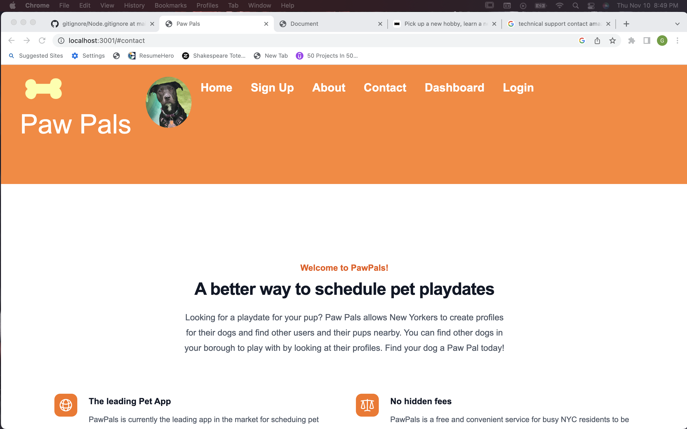
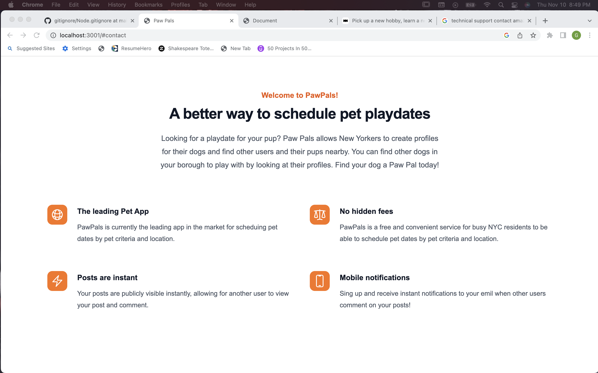
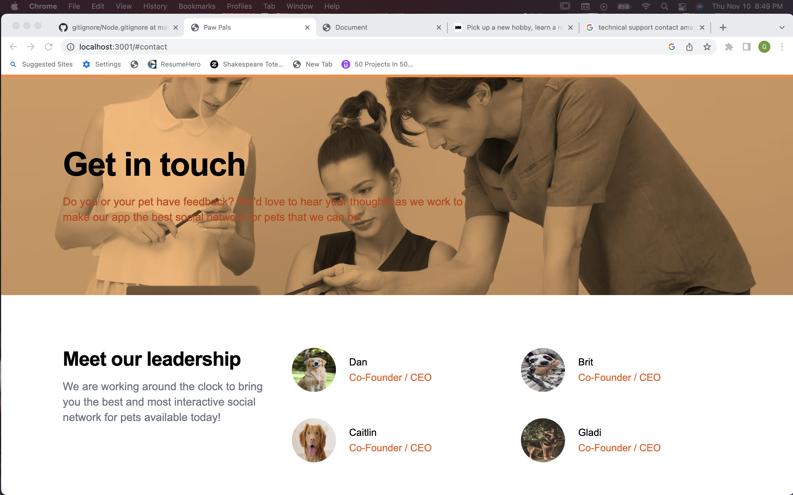
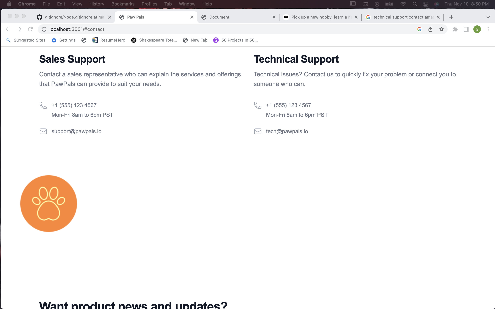
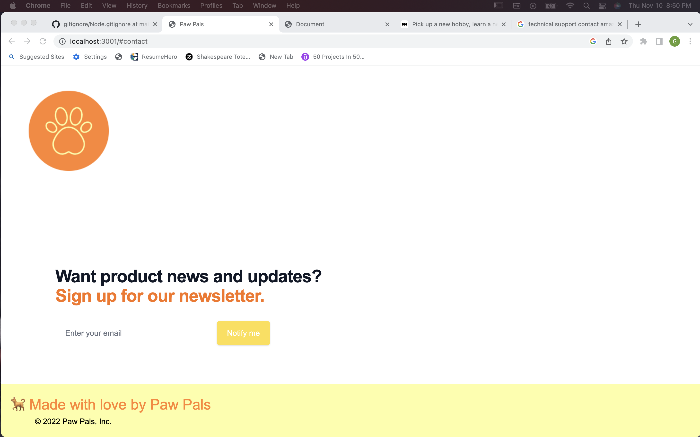

# Paw-Pals

## Project Description
This app connects allows users to set up a profile for their dog and connect users in New York City to set up play times.

## Tools Used to Create This Project
* JavaScript ES6
* CSS
* tailwind (+ negotiator) for CSS
* Node.js
* Express.js
* dotenv 
* MySQL
* Sequelize 
* bcrypt 
* handlebars 
* Heroku 
  * JawsDB (for database handling on Heroku)

## Usage
The application is deployed on Heroku at https://pawpals22.herokuapp.com/

## Future Work
The app as it stands now is our Minimum Viable Product for project consideration. 
Not all initially planned features were completed due to time constaints.
Future functionality includes:
- Log out
- Functionality to rate other users
- Display of all users/ ratings
- Search of all users by borough
- Functionality to set up multiple dog profiles
- Newsletter sign up functionality

## Screenshots:

## Collaborators:
Daniel Papert, Co-Founder
  - Github: [dpapert1995](https://github.com/dpapert1995)
  - Email: dpapert@gmail.com

Brit Sovic, Co Founder
  - Github: [bsovic23](https://github.com/bsovic23)
  - Email: bsovic23@gmail.com 

Caitlin O'Reilly, Co-Founder
  - Github: [caitoreilly](https://github.com/caitoreilly)
  - Email: coreilly29@gmail.com 

Gladimar Vill, Co-Founder
  - Github: [Gladi023](https://github.com/Gladi023)
  - Email: Gladimar.Villamil@gmail.com